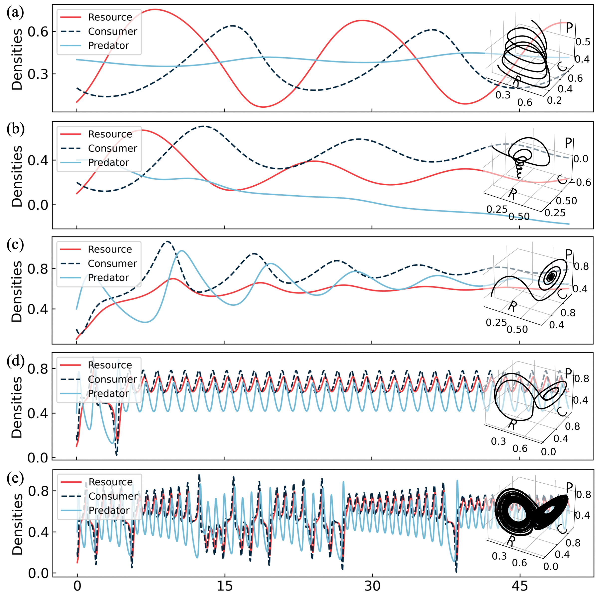

# Neural Dynamical Transfer Learning (NDTL)

This code implements “Dynamics Creation through Neural Dynamical Transfer Learning,” enabling the creation of new dynamics through the fusion of several parent systems.

---

## 📖 Overview

- **Paper**: "Dynamics Creation through Neural Dynamical Transfer Learning" (under review, 2025)
- **Authors**: Qiyang Ge*, He Ma*, Celso Grebogi, and Wei Lin†.
- **DOI**: To appear.

---

## 🛠️ Installation

1. Clone the repository:
   ```bash
   git clone https://github.com/967255/NDTL.git
   cd NDTL
   ```


2. Create a virtual environment (optional but recommended):

   ```bash
   python3 -m venv venv
   source venv/bin/activate  # Linux/Mac
   venv\Scripts\activate     # Windows
   ```
3. Install dependencies:

   ```bash
   pip install -r requirements.txt
   ```

---

## ⚙️ Usage

```bash
# Training:
python src/train.py --config configs/experiment.yaml

# Evaluate:
python src/evaluate.py --checkpoint checkpoints/model.pth

# Notebook:
jupyter notebook notebooks/demo.ipynb
```

---

## 📂 Project Structure

```NDTL
├── README.md         
├── LICENSE                             
├── Lorenz_like/             
│   ├── ode.py
│   ├── pre-train.py
│   └── ...
├── RCP/             
│   ├── ode.py
│   ├── pre_train.py
│   └── ...
├── SEIRS/             
│   ├── ode.py
│   ├── pre-train.py
│   └── ...     
└── docs/      
```

---

## 📝 Examples & Results




---

## 🎓 Citation

If you use this repository, please cite:

```bibtex
@misc{ge2025ndtl,
  author       = {He Ma, Qiyang Ge, Yu Meng, Celso Grebogi, and Wei Lin},
  title        = {{NDTL: Code for “Dynamics Creation through Neural Dynamical Transfer Learning”}},
  year         = {2025},
  howpublished = {\url{https://github.com/967255/NDTL}},
  note         = {}
}
```


---

## 📄 License

This project is licensed under the MIT License. See LICENSE for details.

```
```
